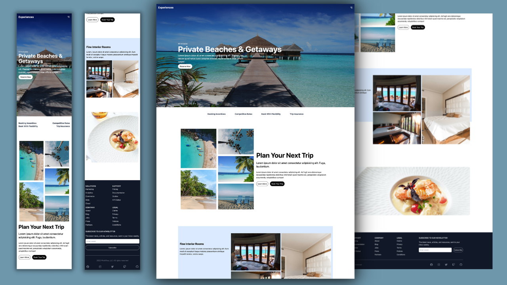

<h1 align="center"> 💻 Web_project - React.JS, TailwindCSS, Next.js and JavaScript </h1>

------

## Documentation # Tailwindcss And  Nextjs

* For full documentation, visit [tailwindcss.com](https://tailwindcss.com/). 
* For full documentation, visit [nextjs](https://nextjs.org/docs/). 
* For full documentation, visit [JS](https://developer.mozilla.org/pt-BR/docs/Web/JavaScript). 
* For full documentation, visit [reactjs](https://pt-br.legacy.reactjs.org/docs/getting-started.html). 

------

### About
* This project presents a modern and elegant website, designed to offer an exceptional user experience on any device. 
* Combining responsive design with visually appealing carousel effects and intuitive 
content organization through grid and flex layouts, the site stands out for its ease of navigation and enhanced
aesthetics. 

* The stylized buttons and Navbar contribute to smooth interaction, ensuring that users find what they need with ease.
* This project is a shining example of how modern web technologies can be combined to create engaging digital experiences.

## Technologies Used

* React.js: Used to build a dynamic user interface with reusable components, facilitating project maintenance and scalability.
  
* Next.js: Used to enhance the user experience through fast, optimized web pages, taking advantage of features such
  as server-side rendering and static site generation.
  
* Tailwind CSS: Adopted to speed up front-end development, allowing efficient and responsive design customization
  directly in the markup, without the need to leave the HTML context.
  

## Featured Resources

* Responsiveness: Fluid design that adapts perfectly to any screen size, from smartphones to high-resolution monitors.
* Carousel effects: Implementation of a dynamic carousel to highlight key elements, improving visual engagement.
* Grid and Flex Layout: Intelligent use of grid and flexbox for an aesthetic and functional content layout,
  optimizing the user experience.
* Stylized Buttons and Navbar: Customized design of buttons and navigation bar to complement the site's visual
  identity and facilitate navigation.
* Sustainable Development: Adoption of TypeScript to improve the reliability and maintainability of the code,
   preparing the project for the future.

## How to Run

* To run the project in your local environment, follow the steps below:

- git clone url-do-repositorio 
- cd nome-do-projeto 
- npm install 
- npm run dev 

<h2 align="center"> 💻 Project</h2>

 

-------

## 🔖 Project on air
You can visualize the project on air [link](https://reactjstailwindcss.netlify.app/  )

## 🔖 Git Clone
You can visualize the project [link]( https://github.com/ludiemert/react-tailwindcss.git )

---

## Contributions

* Contributions are welcome! If you have suggestions for improving the project or want to report bugs, 
feel free to open an issue or send a pull request.

---

#### Contact

#### [**Luciana Diemert**](https://github.com/ludiemert)

🛠 `Front-end` `Back-end`Developer Jr.  
📍 São Jose dos Campos – SP - Brazil

&nbsp;
&nbsp;
&nbsp;
&nbsp;

 

